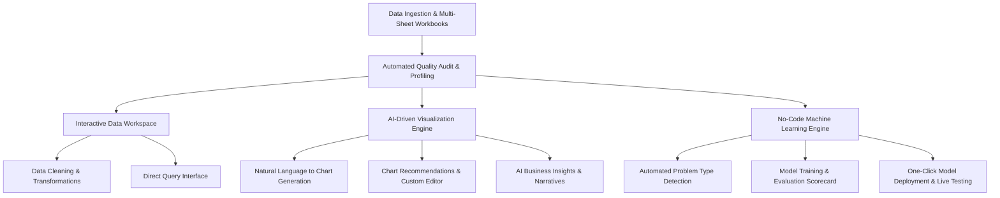
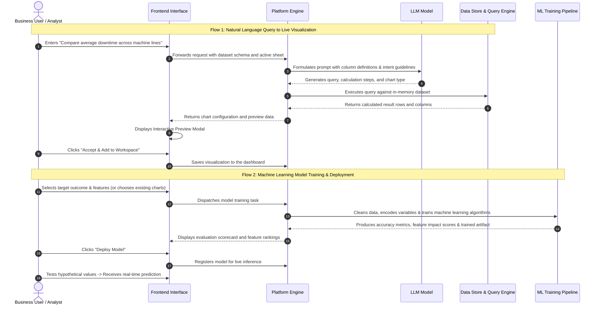

# Enterprise AI Analytics & Machine Learning Platform
## Comprehensive Feature Guide and Architectural Process Overview

---

## 1. Executive Summary

The **Enterprise AI Analytics & Machine Learning Platform** is an end-to-end solution that bridges the gap between raw organizational data and actionable business intelligence. It enables business users, operations managers, and analysts to explore datasets, query numbers using everyday language, generate interactive visualizations, and train predictive machine learning models without requiring coding skills or database syntax knowledge.

Key capabilities include:
- **Data Ingestion & Multi-Sheet Management**: Seamlessly upload single-sheet or multi-sheet workbooks with instant data profiling and health audits.
- **Natural Language Data Retrieval ("Chat with Data")**: Ask business questions in conversational language to automatically retrieve records, calculate aggregates, and generate tailored charts.
- **Visual Intelligence & Verification Modal**: Inspect and verify generated queries, calculation steps, and live chart previews before adding them to dashboards.
- **Automated Machine Learning (AutoML)**: Train, evaluate, and deploy predictive models using visual chart selections or target variables, with an interactive testing sandbox for real-time scenario analysis.

---

## 2. Core Functional Modules

### 2.1. Data Ingestion & Quality Auditing
- **Multi-Sheet Workbook Support**: Ingest standard tabular spreadsheets, including multi-sheet workbooks (e.g., manufacturing production, supply chain, market pricing, defect records).
- **Automated Data Quality Audit**: Instantly assesses the health of uploaded datasets:
  - Detects data classifications (numbers, categories, dates, booleans).
  - Identifies missing data percentages, null cells, and duplicate records.
  - Highlights potential data issues (e.g., skewed distributions, excessive unique categories).
- **Automated Feature Derivation**: Scans temporal columns (such as transaction or production dates) and automatically derives time-based groupings (year, month, day of week) to streamline seasonal analysis.
- **Sheet Navigation**: Users can switch between sheets with a single click, keeping previews focused while retaining the ability to query across sheets.

---

### 2.2. Interactive Data Workspace & Transformations
- **Live Data Grid**: Fast and intuitive data preview with column sorting and filtering.
- **No-Code Data Transformations**:
  - Add calculated columns using mathematical expressions.
  - Impute missing values using standard statistical methods (mean, median, mode, or constant values).
  - Rename, reorder, or drop columns.
  - Filter rows based on business thresholds.
- **Direct Querying**: Run custom query expressions across active sheets or combine multi-sheet tables.
- **Data Export**: Download cleaned, transformed datasets for external reporting.

---

### 2.3. AI-Driven Visualizations & Natural Language Charting
- **Two-Stage Progressive AI Visualization Architecture**:
  - **Stage 1 (Parallel Multi-Perspective Planning)**: Dispatches 3 concurrent, independent LLM planners across the dataset schema:
    - *Single-Variable Planner*: Identifies high-impact KPI metrics, frequency distributions, and percentage share compositions.
    - *Bi-Variable Planner*: Identifies chronological trends (Date + Metric), category rankings, and scatter correlations.
    - *Multi-Variable Planner*: Identifies segmentations, multi-series trends, bubble clusters, and cross-sheet join relationships.
    - *Plan Combination & Deduplication*: Unifies planner proposals, deduplicates redundant charts, and produces a balanced 10–12 chart plan.
  - **Stage 2 (Independent Chart Generation & Progressive SSE Streaming)**:
    - Generates specifications, SQL queries, and calculations for **one chart at a time** to eliminate token pressure and prevent all-or-nothing failures.
    - Employs Server-Sent Events (SSE) to stream completed visualizations immediately to the client interface.
    - Validates SQL syntax and safety, executes in-memory queries, and saves charts in real-time.
    - Live charts appear dynamically on the screen as they are generated without waiting for the full batch.
- **Natural Language Chart Generator ("Chat with Data")**:
  - Positioned prominently in the visualization workspace.
  - Users type requests in plain English (e.g., *"Compare average machine downtime across lines"* or *"Show monthly defect rates by supplier"*).
- **Interactive Verification & Preview Modal**:
  - Before any generated chart is saved to the workspace, an interactive preview modal appears.
  - **Live Chart**: Displays the fully rendered, interactive chart.
  - **Transformation & Calculation Steps**: Explains the exact logic applied (e.g., groupings, averages, filters).
  - **Executed Query**: Shows the underlying query used to pull the data, with a one-click copy option.
  - **Result Data Table**: Displays sample rows returned by the query for immediate validation.
  - **Accept & Discard Actions**: The user has full control to accept the visualization into their workspace or discard it.
- **AI Business Insights**: Generate automated textual summaries highlighting trends, peak values, and key takeaways for any chart.

---

### 2.4. Machine Learning & Predictive Modeling
- **Automated Objective Detection**:
  - The user selects a column they wish to predict.
  - The platform automatically identifies whether the problem is **Classification** (predicting categories, e.g., pass/fail), **Regression** (predicting numerical quantities, e.g., maintenance cost or downtime hours), or **Clustering** (identifying natural groupings).
- **Visualization-to-Model Feature Selection**:
  - Users can select existing charts from their visualization workspace, and the platform automatically extracts the underlying columns to serve as input features for model training.
- **Model Training & Evaluation**:
  - Automatically trains machine learning algorithms using historical records.
  - Validates models against reserved test data and displays an intuitive performance scorecard (accuracy, error metrics, precision, and feature importance rankings).
- **One-Click Deployment & Interactive Scenario Testing**:
  - Deploys models into an active registry with a single click.
  - Provides a scenario testing interface where users can adjust input variables to receive immediate predictions.

---

## 3. System Architecture & Processing Flows

---

### 3.1. How Natural Language Queries Retrieve Data (Query-to-Data Process)

1. **Context & Schema Assembly**:
   When a user submits a natural language question, the system collects the structural schema of the dataset (sheet names, column headers, recognized data types, and value distributions). This contextual snapshot contains no sensitive row-level data, preserving privacy and minimizing processing overhead.

2. **Intent Interpretation by the LLM Model**:
   The LLM model receives the user's prompt alongside the schema context and performs three coordinated tasks:
   - **Query Formulation**: Constructs a structured data retrieval query tailored to extract, aggregate, and sort the requested figures.
   - **Calculation Summarization**: Formulates a plain-language summary of the transformations applied (e.g., grouping by machine ID, averaging downtime hours, ordering descending).
   - **Chart Type Selection**: Determines the most effective visual representation (e.g., bar chart for categorical comparisons, line chart for temporal trends, scatter plot for correlations).

3. **Secure In-Memory Data Execution**:
   The generated query is executed directly against the platform's high-speed in-memory data engine. The engine computes aggregations and retrieves the specific result subset.

4. **Human-in-the-Loop Review (Preview Modal)**:
   The calculated results and chart specifications are displayed inside an interactive preview modal. The user reviews the chart, examines the transformation steps, and inspects the raw result rows. Clicking **Accept** commits the visualization to the workspace under its appropriate category.

---

### 3.2. How Machine Learning Models Are Trained and Deployed

1. **Problem Definition & Target Identification**:
   The user specifies the target variable they wish to forecast or understand. The system analyzes the distribution of this column to select the appropriate analytical task:
   - *Numerical targets* $\rightarrow$ Regression algorithms.
   - *Categorical targets* $\rightarrow$ Classification algorithms.

2. **Feature Extraction & Preprocessing**:
   Features can be selected manually or extracted automatically from charts previously accepted into the visual dashboard. The training pipeline processes the data through automated preparation stages:
   - Missing values are imputed using statistical baselines.
   - Numerical values are normalized to balanced scales.
   - Text categories are converted into numerical representations suitable for machine learning algorithms.

3. **Algorithm Training & Validation**:
   The dataset is split into training and validation sets. The machine learning algorithms identify patterns, weights, and correlations from historical records. The platform evaluates the trained model on validation records to generate performance metrics and determine **Feature Importance** (showing which factors have the highest influence on the predicted outcome).

4. **Deployment & Real-Time Simulation**:
   With a single click, the trained model is deployed to an active registry. Users can access a built-in simulation panel to enter hypothetical values for any input factor and immediately see the model's predicted outcome, enabling rapid "what-if" decision-making.

---

## 4. Summary: Traditional Workflow vs. Platform Workflow

| Operational Step | Traditional Approach | Platform Approach |
| :--- | :--- | :--- |
| **Data Ingestion** | Requires manual database loading and script setup | Drag-and-drop CSV or multi-sheet Excel with instant profiling |
| **Data Exploration** | Writing complex manual queries or pivot tables | Natural language questions automatically translated into queries |
| **Chart Creation** | Manual visual configuration step-by-step | Automated recommendations and natural language chart generation |
| **Verification** | Trial-and-error visual creation | Interactive preview modal showing chart, query, and raw data before accepting |
| **Predictive Modeling** | Requiring specialized data science tools and code | Automated problem detection, visual training, and one-click deployment |
