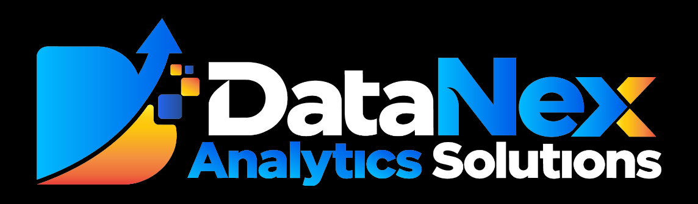
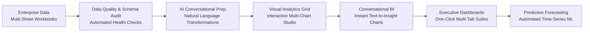

# PRAJNA AI PLATFORM
## Enterprise Decision Intelligence & Predictive Analytics
### Product Demonstration & Capability Report

---

## 1. Executive Summary

In today's fast-moving enterprise environment, decision-makers are frequently hindered by fragmented data sources, sluggish reporting cycles, and a persistent dependency on technical teams for basic business answers. 

**PRAJNA** (*Predictive Research & Analytics for Judgement, Navigation & Action*), developed by **DataNex Analytics Solutions**, is an end-to-end intelligent decision platform designed to eliminate these barriers. PRAJNA empowers business leaders, operations managers, and analysts to transition seamlessly from **raw operational data** to **actionable visual intelligence** and **forward-looking predictive forecasts**—all within minutes, and without writing a single line of SQL or code.

### Core Value Drivers for Enterprise Clients
- **Unified Multi-Source Operations**: Consolidate disparate operational sheets (Production, Sales, Inventory, Maintenance) into a single cohesive workspace.
- **Autonomous Data Quality Assurance**: Automated schema discovery and proactive data quality auditing guarantee reliable numbers before decisions are made.
- **Human-in-the-Loop Conversational AI**: Clean, filter, and transform data using everyday English with transparent "Action Proposals" that keep business users in total control.
- **Conversational Text-to-Insight**: Ask direct business questions in natural language and instantly receive executive narrative interpretations paired with live interactive charts.
- **AI-Powered Dashboard Synthesis**: Generate complete, board-ready, multi-tab analytical dashboards automatically or craft custom views on an intuitive visual canvas.
- **Zero-Code Predictive Forecasting**: Bridge the gap between past performance and future strategy with one-click automated time-series machine learning models.

---

## 2. End-to-End Solution Architecture: How It Works

---

## 3. Screen-by-Screen Product Walkthrough

---

### Screen 1: Unified Multi-Workbook Data Management & Live Inspection

.png)

#### What the Client Sees
A centralized, modern data management console displaying the entire enterprise dataset. In this demonstration, a complete operational workbook featuring **1,200 rows and 27 columns** across multiple operational domains is ready for instant exploration.

#### Key Product Features & Client Capabilities
- **Cross-Functional Workbook Tabs**: Instant, tabbed navigation across all operational disciplines including **Production, Sales, Inventory, Quality, Maintenance, Employees, Suppliers, Monthly KPIs**, and **Product Masters**.
- **Instant Grid Preview**: High-speed, responsive record preview displaying operational details (Production Codes, Plant locations, Product IDs, Planned vs. Actual output, and Good Quantities).
- **Flexible Data Export**: One-click extraction of filtered views into **CSV**, **Excel**, or **Clipboard** for immediate offline collaboration.
- **Frictionless Navigation**: Dedicated action button (**Go to Visualizations**) seamlessly transfers cleaned data straight into visual exploration without export/import friction.

#### Strategic Client Benefit
> Eliminates disconnected data silos. Operational leaders can review cross-departmental records in a single interface without requesting specialized data exports from IT.

---

### Screen 2: Automated Data Quality Auditing & Schema Intelligence

.png)

#### What the Client Sees
An automated diagnostic screen that scans every dataset upon arrival, mapping out column types, uniqueness, completeness, and potential data pitfalls before any reporting takes place.

#### Key Product Features & Client Capabilities
- **Proactive Quality Warnings**: The platform automatically flags anomalies, such as high-cardinality fields (`Order_ID` with 1,200 distinct values) that might be unique identifiers or free text, preventing skewed aggregations.
- **Intelligent Schema Classification**: Instant categorical, datetime, and numerical profiling across all metrics (e.g., Customer, Region, Unit Price, Revenue).
- **Live Statistical Baselines**: Immediate visibility into distribution ranges (Minimum, Maximum, and Mean values) and real-time null percentages, guaranteeing clean data.

#### Strategic Client Benefit
> Provides complete peace of mind. Executives and clients can trust the integrity of their business intelligence, knowing that anomalies are detected and flagged before influencing strategic decisions.

---

### Screen 3: Conversational AI Data Prep & Smart Action Proposals

.png)

#### What the Client Sees
An integrated **AI Data & Transformation Assistant** where users converse directly with the data engine using plain English prompts. The AI interprets business intent and drafts structured **Action Proposals** for user validation.

#### Key Product Features & Client Capabilities
- **Natural Language Data Manipulation**: Business users simply type what they need: *"Remove duplicate rows"*, *"Fill missing values in Inventory_ID using column median"*, or *"Create calculated column from Inventory_ID and Date"*.
- **Human-in-the-Loop Governance**: Rather than applying opaque automatic alterations, PRAJNA presents a clear **Action Proposal** with explicit **Execute** and **Dismiss** buttons, ensuring users maintain total operational control.
- **Context-Aware Suggestions**: Guided chips prompt non-technical users with optimal next steps based on current dataset health.

#### Strategic Client Benefit
> Democratizes data wrangling. Non-technical business analysts can perform complex data transformations and data cleaning routines in seconds without writing scripts or waiting for data engineers.

---

---

### Screen 4: Self-Service Interactive Visual Analytics Grid

.png)

#### What the Client Sees
A responsive visualization grid showcasing 11 dynamically generated analytical views. Each card provides interactive chart representations spanning single-variable distributions to complex multi-variable relationships.

#### Key Product Features & Client Capabilities
- **Rich Visual Variety**: Includes **Defect Rate Distributions**, **Maintenance Type Counts** (Preventive, Corrective, Predictive, Emergency), **OEE vs. Defect Rate** trend lines with timeline navigation sliders, and **Revenue by Region** comparisons.
- **On-the-Fly Customization**: Interactive dropdowns let users switch chart types (e.g., from Bar to Line or Area) instantly without regenerating data queries.
- **One-Click Action Suite**:
  - **Generate Insights**: Triggers an on-demand AI narrative summary explaining the key business drivers behind the chart.
  - **Add to Dashboard**: Instantly saves the visual card to custom dashboard presentations.
  - **Train ML Model**: Direct bridge connecting visual patterns directly into predictive machine learning.

#### Strategic Client Benefit
> Accelerates business discovery. Managers can visually inspect quality metrics, machine performance, and revenue distribution simultaneously, spotting bottlenecks and opportunities immediately.

---

### Screen 5: Live Conversational AI Analytics ("Text-to-Insight")

.png)

#### What the Client Sees
A conversational intelligence hub that interprets business questions, runs cross-table SQLite analytical queries, generates a narrative business summary, and renders a live, interactive visualization directly in the chat stream.

#### Key Product Features & Client Capabilities
- **Natural Language Chart Generation**: The user enters *"Generate a chart showing monthly revenue"*, and the AI instantly queries the multi-sheet data to produce an interactive **Monthly Revenue Trend** chart.
- **Automated Executive Commentary**: PRAJNA provides context-rich business storytelling:
  > *"The chart illustrates a consistent upward trajectory in monthly revenue throughout 2025, rising from approximately $4.2 million in January to over $6.1 million by October. This trend highlights strong business growth, with the most significant acceleration occurring in the second half of the year."*
- **Enterprise-Grade Governance**: Executes strictly read-only queries with verified security boundaries.
- **Interactive Suggested Prompts**: Quick-access prompts such as *"What is the average downtime of each machine?"* and *"Which plant has the highest defect rate?"* guide users to high-impact operational insights.

#### Strategic Client Benefit
> Replaces static reporting with real-time conversational intelligence. Executives obtain answers and presentation-ready charts in seconds during live business reviews.

---

### Screen 6: AI-Assisted Smart Dashboard Generation

.png)

#### What the Client Sees
An intuitive dashboard creator modal offering flexible modes of creation: starting with a **Blank Canvas** or selecting **Generate with AI**.

#### Key Product Features & Client Capabilities
- **Automated Layout Synthesis**: By selecting **Generate with AI**, the platform's AI engine analyzes dataset schemas, column semantics, and key performance indicators to generate a complete multi-tab layout automatically.
- **Source Selection**: Seamlessly link dashboards to any active project session (e.g., *demo* with 1,200 rows and 23 columns, or *Apex Precision Manufacturing Operations*).
- **Custom Titling & Framing**: Set dashboard titles and configure layout parameters with a single click.

#### Strategic Client Benefit
> Eliminates the tedious chore of building reports from scratch. Complete, multi-section analytical dashboards are generated in seconds, slashing report creation time by 90%.

---

---

### Screen 7: Multi-Tab Interactive Dashboard Studio (Editor Mode)

.png)

#### What the Client Sees
The dynamic dashboard editing studio, organized into structured thematic tabs (**Executive Overview**, **Temporal Trends**, **Plant & Product Analysis**, and **Stock Health & Valuation**), shown styled in the sleek **Royal Indigo Glass** theme.

#### Key Product Features & Client Capabilities
- **Tabbed Narrative Flow**: Organizes complex operations into digestible sections with widget counts (e.g., 6 executive metrics, 3 temporal trends).
- **Responsive Layout Control**: Fine-grained widget dimension controls (Full-width, 6/12 columns, customizable pixel heights) allowing users to tailor visual hierarchy.
- **Widget-Level Conversational Intelligence**: Every card features an individual **Ask AI** button, allowing stakeholders to drill down into specific charts directly without leaving the dashboard canvas.
- **Seamless Mode Toggling**: Instantly switch between **Editor** and **Preview** modes or share the dashboard across team members.

#### Strategic Client Benefit
> Empowers cross-functional collaboration. Teams can structure executive briefings that tell a coherent operational story while retaining the ability to drill down interactively on any chart.

---

### Screen 8: Boardroom-Ready Executive Presentation & KPI Command Center

.png)

#### What the Client Sees
The polished, high-impact **Executive Presentation View** designed specifically for leadership reviews, quarterly briefings, and client presentations.

#### Key Product Features & Client Capabilities
- **High-Impact KPI Summary Cards**: Instant visibility into top-level operational health:
  - **Total Inventory Value**: **1.42B** (Live SUM aggregation)
  - **Average Unit Cost**: **460.69** (Live AVG metric)
  - **Total Items Received**: **1.05M**
  - **Total Items Issued**: **1.11M**
- **Dynamic Operational Visuals**:
  - **Stock Health Distribution**: Clean Donut chart revealing **86.08% Healthy** vs. **13.92% Reorder** ratios.
  - **Inventory Value by Category**: Richly colored breakdown highlighting inventory concentration across **Electrical ($409.78M)**, **Assemblies ($287.25M)**, and **Valves ($82.53M)**.
- **Executive Styling Suite**: Toggle between Dark and Light presentation modes, customize accent palettes, apply Metallic styling, or engage Fullscreen projection.

#### Strategic Client Benefit
> Delivers instant executive clarity. C-level leaders and board members receive immediate, high-fidelity answers to critical business questions without wading through dense spreadsheets.

---

### Screen 9: Predictive AI & Automated Time-Series Forecasting

.png)

#### What the Client Sees
A dedicated **Time-Series Forecasting** modal accessible directly from any temporal visualization (e.g., *Monthly Inventory Value Trend*), seamlessly elevating the user from descriptive reporting to predictive foresight.

#### Key Product Features & Client Capabilities
- **Automatic Axis Detection**: The system automatically detects temporal dimensions (`Date_month`) and target metrics (`Inventory_Value`) without manual configuration.
- **Automated Feature Engineering & Model Selection**: PRAJNA automatically constructs sliding-window lag features and evaluates optimal predictive algorithms (including LSTM, Gradient Boosting, and Ridge Regression).
- **Customizable Forecast Horizon**: Flexible projection horizon selector (e.g., **+6 periods** forward) tailored to business planning cycles.
- **One-Click Model Training**: A single click on **Train ML Model** trains the model and overlays predictive trajectories directly onto historical data.

#### Strategic Client Benefit
> Transforms historical hindsight into actionable foresight. Organizations can anticipate inventory requirements, optimize capital allocation, and mitigate supply chain risks ahead of time.

---

## 4. Platform Capability Comparison Matrix

| Operational Capability | Traditional BI Tools | Custom Scripting / Excel | PRAJNA AI Platform (DataNex) |
| :--- | :--- | :--- | :--- |
| **Data Ingestion** | Complex ETL pipelines required | Manual copy-pasting | **Instant multi-sheet workbook ingestion** |
| **Data Quality Auditing** | Manual rules setup | Prone to human error | **Automated anomaly & cardinality alerts** |
| **Data Preparation** | Requires SQL/Python expertise | Fragile macros | **Natural language AI chat with action proposals** |
| **Ad-Hoc Querying** | IT ticket queue (days/weeks) | Manual formula lookups | **Conversational Text-to-Insight in seconds** |
| **Insight Generation** | Manual human commentary | High latency | **Instant automated narrative storytelling** |
| **Dashboard Creation** | Drag-and-drop manual hours | Static workbook charts | **AI-synthesized multi-tab suites in 1-click** |
| **Predictive Forecasting** | Separate Data Science team | Basic linear projections | **Built-in automated ML with horizon selection** |

---

## 5. Summary & Client Next Steps

The **PRAJNA AI Platform**, powered by **DataNex Analytics Solutions**, bridges the gap between complex enterprise data and agile business decision-making. By uniting data governance, conversational exploration, automated dashboard generation, and zero-code machine learning, PRAJNA empowers organizations to:
1. **Reduce Time-to-Insight** from days to seconds.
2. **Eliminate Operational Silos** across production, inventory, and finance.
3. **Decide with Confidence** backed by automated data audits and predictive forecasting.

---

*Report prepared by DataNex Analytics Solutions · PRAJNA AI Platform Demonstration*
